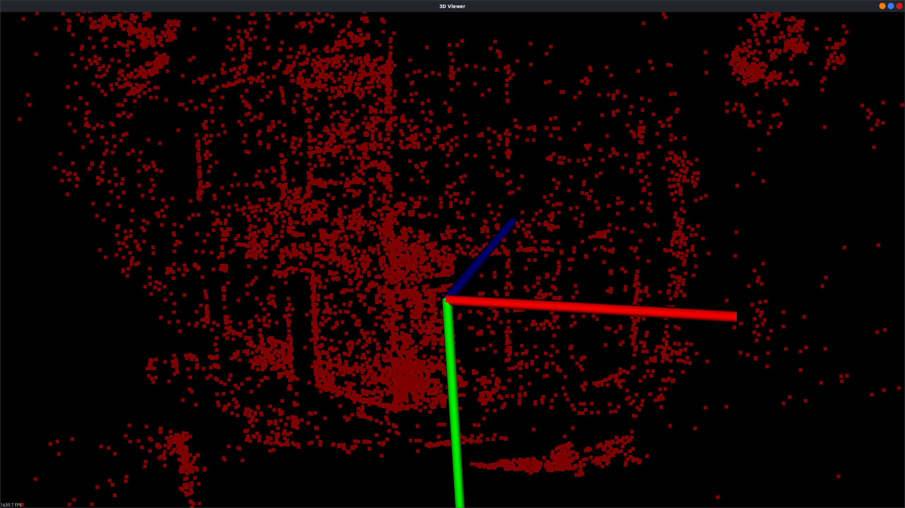

## 简介

​		此项目是在学习SFM的过程中，为了检验整体的三维重建流程以及学习相关基础算法而构建。主要目标为依照colmap这篇论文的框架，使用增量式SFM重建算法，完成整体框架的搭建，同时个人实现相关重建算法。

## 项目依赖

OpenCV(4.6.0)  Eigen(3.4.0) Ceres  glog pcl

## 整体介绍

### 重建结果

​		整体思路为构建一个增量式SFM的框架，同时在之后的学习中能够在这上面实验相关的算法。输入为一系列图片，保存在`newimage`文件夹中，运行完成后会利用PCL库的点云检测功能，显示所生成的点云。目前用于测试的图片为一栋房屋的一角，最后的重建效果如下：

​		最终的结果能够看出房屋的一个轮廓，目前由于实现的只是一些十分基础的算法，外点过滤功能并不完善，同时Z轴方向的外点也没有过滤完，重投影误差仍然较大。目前仍在慢慢学习，进行相关完善。

​		最终得到的点云信息保存在了`poingClouds`文件夹下的`TestData.pcb`中。初次运行可能无法显示正确的点云，在运行2-3次后便能得到正确的结果（原因还不清楚）。

### 增量式SFM算法的重建

​		实现的增量式SFM算法的流程与colmap那篇论文中使用的整体流程一致，分为特征点提取以及增量式重建两个阶段。

#### 特征点提取

​		特征点提取部分目前使用的是SIFT算法进行的特征点提取，为OpenCV自带的函数，没有自己实现。在特征点匹配阶段同样是使用的OpenCV中的BFMatcher进行的穷举试匹配方法。目前用于测试的图片只有10张，仍可以使用10张图片进行测试，如果输入数据进一步增大，一是运行时间过长，二是外点过多。目前使用的外点过滤方法是利用两个图片之间的$F$矩阵以及$M$矩阵，只有误差小于限定的范围的点才会被使用。目前还没有实现三点验证，导致目前的外点过多。在10张输入图片的情况下外点已经对重建有了明显的影响，目前还没有测试更多图片最后的重建结果。

此部分下一阶段的目标有两个：

1. 完善特征点匹配算法，不再使用穷举匹配法，而是使用字典树以及对应构建的K-tree进行特征点的匹配。主要思路是构建一个字典，为每一张图片构建一个对应的描述。首先进行图片之间的匹配，随后图片之间特征点的匹配。
2. 完善外点过滤算法，实现三点验证。

#### 增量式重建

​		在初始化部分没有实现十分复杂的算法，目前只是简单的寻找一组图片，另这两张图片与其他图片之间匹配上的特征点数量之和最大，同事这两张图片之间匹配上的特征点数量要超过一个阈值。目的是在提供一个较为准确的先验重建结果的同事，能与其他图片有尽可能大的重叠部分，为之后的重建做准备。

​		在完成初始化后，下一张最佳图片的选择方法为寻找一个与当前所有已完成重建的图片之间匹配上的特征点数量最多的一张图片。图像注册是直接使用的OpenCV自带的PnP算法，多视图三角化是构建的矩阵方程求解，多视图三角化目前是自己完成的一个简单的函数。

​		最后的BA阶段目前还没有完成，写了一个测试的BA，但是效果不够满意，仍在修改这部分。

此部分下一阶段目标：

1. 完善多视图三角化算法
2. 完成BA算法

## 总结

​		目前只是以及简单的重建方法，在学习过程中一直在进行修改。